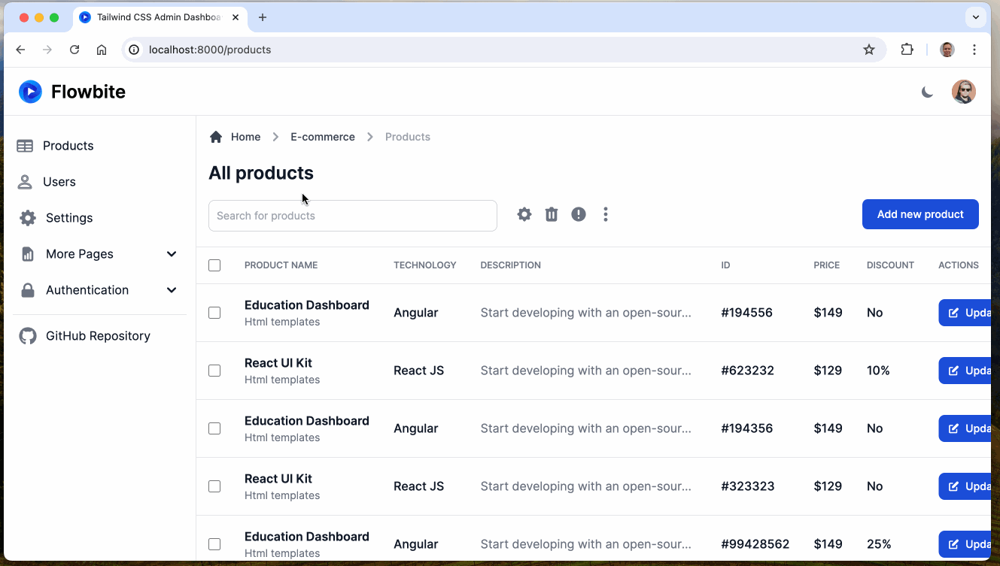

# Roc + HTMX + tailwindcss Demo

Inspired by the [flowbite-admin-dashboard](https://github.com/themesberg/flowbite-admin-dashboard), this is an example web app using [roc](https://www.roc-lang.org), [htmx](https://htmx.org), and [tailwindcss](https://tailwindcss.com).

The goal of this repository is to be a good starting point for building web apps with roc, and demonstrate how to use familiar technologies like htmx and tailwindcss.

There's a lot of things that can be improved... so if you would like to contribute to this demo, feel free to open an issue or submit a PR.

## Getting Started

To use the build script `bash build.sh`, you will need the following in your `PATH`variable;
1. [roc](https://www.roc-lang.org/install)
2. [rtl](https://github.com/isaacvando/rtl)
3. [tailwindcss](https://tailwindcss.com/docs/installation)
4. [simple-http-server](https://crates.io/crates/simple-http-server)

Alternatively, run the steps manually and make use of the `--watch` cli commands for a nicer development experience.
